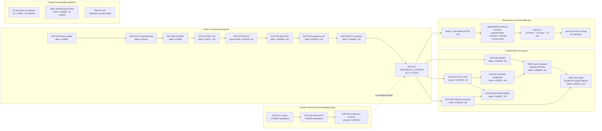

# Experiment graph

Граф показывает causal/recipe lineage, а не просто хронологию. `delta` относится только к указанному parent и protocol.



## Edge semantics

- Solid arrow: artifact-backed parent/component/recipe relation.
- `EXP-003…037` are absorbed or nested in champion; their historic deltas cannot be summed again.
- `EXP-047→051` is numerical OOF replay with a fixed production recipe, not a second independent gain.
- `EXP-059 + EXP-051 → NEW fixed compound` is the missing historical combination measured in this audit.
- `EXP-040 + EXP-047 → EXP-049` was already tested: total gain positive, interaction antagonistic.
- Dashed `EXP-046→EXP-037` denotes a falsified transfer: standalone rounds/seed gains collapse inside champion.
- Parallel-pipeline nodes have incompatible validation or missing common OOF; no additive edge is asserted.

## Champion composition and ownership

| slot | weight | first decisive evidence | status |
|---|---:|---|---|
| CAP / S1-E03a | 0.10 | `EXP-006`, retained as extrapolation insurance in `EXP-014/025` | absorbed |
| UNC / S1-E02 | 0.20 | `EXP-003/006` | absorbed |
| DIST | 0.25 | `EXP-014` | absorbed |
| ETX-AVG3 | 0.225 | `EXP-036/037` | absorbed |
| SEQ-AVG3 | 0.225 | `EXP-025/026/035/037` | absorbed |

## Compatibility frontier

The only fully pairable, production-supported frontier beyond champion is:

```text
EXP-037
  + fixed sequence-slot reweight from EXP-059
  + fixed 5% BTYD direction from EXP-051
= 1.746947164 wCV
```

FRESH is the next OOF-supported edge, but its production node is missing. Teammate occurrence/meta is a separate exploration branch until canonical OOF is restored.
