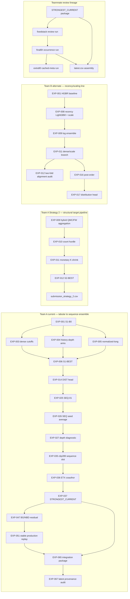

# Solution ancestry and parallel research lines

This graph reconstructs lineage; it does not propose a new ensemble. Solid
edges are backed by primary reports, run artifacts, or manifests. The full
machine-readable graph is `ancestry_edges.csv`.

## What the principal nodes contain

- `S1-BEST` is the log-space blend of the dense-cutoff, normalized-long, and
  history-depth tabular components. Its three calibration-level submissions are
  distinct files but one model recipe.
- `S1-DIST-MIX` introduces the multiclass distribution head. `SEQ-01-MIX` then
  adds a causal TCN. EXP-026 changes seed averaging, blend weights, and the test
  depth policy together; EXP-027 is the diagnostic that separates the depth
  transfer failure from ordinary local CV.
- EXP-035 replaces the sequence slot with a three-seed clip-289 average.
  EXP-036 measures ETX both standalone and as a TCN coauthor. EXP-037 combines
  CAP/UNC/DIST with equal ETX/TCN halves inside the sequence slot and produces
  `submission_STRONGEST_CURRENT.csv`.
- EXP-047 and EXP-051 form a parallel BG/NBD residual/production branch.
  EXP-051 numerically replays EXP-047 OOF but changes the production optimizer
  and test artifacts. EXP-065 packages both EXP-037 and EXP-051; package ACCEPT
  is an integrity verdict, not a new CV improvement.
- The teammate review line starts from the preserved STRONGEST package and
  trains hurdle/occurrence experts before cached meta evaluation. `latest.csv`
  is strongly reconstructed as an artifact, but its reported LB event is not
  SHA-bound and therefore is absent from confirmed leaderboard chronology.

## Other parallel lines

- Team B core is a separate LightGBM two-decision-fold line rooted at
  `team_b_core:EXP-001`. It explores feature groups, calibration, hurdle
  variance, seasonality, and temporal blending. Its later named CSVs are absent;
  reported LB values remain report-only.
- Team B alternate is a separate HGBR/recency/scale line. Single-cutoff and
  two-fold scores are kept in different comparison classes. Its reported LB
  files are also absent from the available checkout.
- The unnumbered S04 LightGBM run is a machine-only auxiliary-supervision line.
  Its three submissions survive and their formulas were reconstructed exactly,
  but the original final-blend manifest is missing.
- Independent renewal, calendar, domain-shift, global-regime, and exact-
  anniversary branches test separate mechanisms against branch-specific
  anchors. Their local numeric IDs collide with other namespaces and are never
  used without prefixes.

## Lineage caveats

An arrow means “used as baseline, parent, component, replay source, or package
input,” not “strictly improved.” Different branches use incompatible validation
protocols. Public LB, local CV, fixed-weight ensemble CV, LOFO, simulation, and
diagnostic AUC are not placed on a common numeric scale.

